# UI Contract: YouTube Clip Download

**Feature**: `001-youtube-clip-download` | **Date**: 2026-09-18 | **Phase**: 1 | **Revision**: 2.1 (single page, no client state)

Defines what the single-page application must expose to users, independent of component implementation. Complements [openapi.yaml](openapi.yaml) and [data-model.md](../data-model.md).

## Routes

| Route | Purpose | Spec |
|-------|---------|------|
| `/` | The whole app: paste URL → pick range/format/quality → Download. | US1–US4 |
| `*` | Redirect to `/` | — |

No router library; `vercel.json` rewrites every path to `/index.html`. The API base URL is `import.meta.env.VITE_API_BASE_URL`. The page keeps no state across reloads (R13).

## Page states

```mermaid
stateDiagram-v2
    [*] --> Booting: page load → GET /api/health (90 s timeout)
    Booting --> Idle: health ok
    Booting --> Waking: no answer after 3 s (banner; input still usable)
    Waking --> Idle: health ok
    Waking --> ServerDown: health failed after 90 s (banner with Retry)
    Idle --> Resolving: valid URL submitted
    Resolving --> Loaded: 200 VideoInfo
    Resolving --> UrlError: 400 / 422 / 502 Error
    UrlError --> Resolving: URL edited
    Loaded --> Downloading: Download clicked (opens /api/clip in new tab)
    Downloading --> Loaded: user returns; hint stays visible
    Loaded --> Resolving: different URL pasted
```

**Booting / Waking / ServerDown** (R10; spec edge case "Service still starting up"): a slim banner at the top — `server_waking`. Download is disabled until health answers; URL entry and validation work meanwhile. If health fails after 90 s: `server_down` with a Retry button.

**Idle**: URL input focused, nothing else.

**Loaded** shows, in order:
1. **Video card** — thumbnail, title, channel, total duration (FR-003).
2. **Range selector** — dual-handle slider over `[0, duration_s]`, start/end timestamp fields, ±1 s nudge buttons, zoom window for long videos, *Preview selection* (hidden when `embeddable = false`), and the **boundary notice** (FR-015). Start pre-filled from `start_hint_s` (FR-004).
3. **Format picker** — *Video*: MP4 (default), WebM · *Audio*: MP3, M4A, OGG, Opus; each labelled with its kind (US2). WebM disabled with hint when `resolutions.webm` is empty; audio options disabled with `no_audio` when `has_audio = false`. MP3/OGG carry `audio_convert_note`.
4. **Quality picker** — video formats only; lists `resolutions[format]` heights descending, highest pre-selected (FR-011); shows `mp4_hi_res_note` when the selected MP4 variant's `vcodec ≠ avc1`.
5. **Size estimate** — `size_estimate` per data-model → Size estimate (FR-009); at ≥ `VITE_LARGE_DOWNLOAD_BYTES` (500 MB) adds `large_download_note`. Never blocks (FR-006).
6. **Download** — an anchor `<a href="{API}/api/clip?…" target="_blank" rel="noopener">` styled as the primary button, label *"Download 30 s clip"* / *"Download 1 h 12 min clip"* (FR-009). Rendered without `href` (disabled) while validation fails or the server is waking.
7. **Download hint** (after click, FR-021) — `download_hint`, plus *Make another clip*, which keeps the video loaded and resets only the range/format (FR-023).

## Client-side validation (mirrors data-model → Validation rules)

| Condition | UI behaviour |
|-----------|--------------|
| `end ≤ start` or `end − start < 1` | Download disabled; `end_before_start` under the end field (US1 scenario 4) |
| `end > duration` | Clamp to duration; `end_clamped` note (US1 scenario 5) |
| `start < 0` | Clamp to 0 with the same style of note |
| Unparseable timestamp | Field outlined; `bad_timestamp` |
| Not a YouTube URL | `not_youtube` (US1 scenario 6) |
| Playlist-only URL | `playlist_only` |
| Server `Error` from resolve | Show `message`; for `bot_check`/`extraction_failed` append `try_again_suffix` |
| Server error during download | Appears in the download tab as the API's self-contained HTML error page with *Back to the app* (FR-019). The SPA cannot observe cross-origin downloads, so it also shows `download_failed_hint` under the hint |

No client-side check exists for maximum duration or number of clips (FR-006, FR-007).

## Range selector behaviour (US3)

- Two native `<input type="range">` handles bound to `start`/`end`; dragging updates the paired field live and seeks the preview (scenario 1). Typing moves the handle on blur/Enter (scenario 2). Handles cannot cross (`other ± 1 s`).
- Keyboard: ←/→ ±1 s, Shift ±10 s, PageUp/Down ±60 s; `aria-valuetext` = `HH:MM:SS`.
- Touch works through the native inputs (scenario 5).
- Zoom narrows the visible window (e.g. 5 min around the selection) so 1 s precision is reachable on a 10-hour video (scenario 4); zoom never changes values.
- Preview: IFrame API `seekTo(start)`, `playVideo()`, poll `getCurrentTime()` every 250 ms, `pauseVideo()` at `≥ end` (scenario 3). Muted by default (autoplay policy) with an unmute control.

## Accessibility & responsiveness (FR-024)

- All controls keyboard-operable; focus order follows the visual order above.
- Notes never rely on colour alone.
- Single column below 768 px; usable at 360 px wide; no hover-only affordances.

## Copy deck

| Key | Text |
|-----|------|
| `server_waking` | Starting the server… free hosting sleeps when idle, so this can take up to a minute. |
| `server_down` | The server isn't responding right now. |
| `boundary_notice` | Clips are cut at the nearest natural point, so your file may include a few extra seconds at the start or end. |
| `end_before_start` | End must be after start. |
| `end_clamped` | End adjusted to the video's length ({duration}). |
| `bad_timestamp` | Use HH:MM:SS, MM:SS, or seconds (e.g. 1:05, 65, 1h5m). |
| `not_youtube` | Please paste a link to a YouTube video (youtube.com or youtu.be). |
| `playlist_only` | That link points to a playlist. Paste a link to a single video. |
| `no_audio` | This video has no audio track to extract. |
| `mp4_hi_res_note` | Above 1080p, MP4 uses the VP9/AV1 codec; very old players may not support it. |
| `audio_convert_note` | Converted on the server — slower for long clips. |
| `size_estimate` | ≈ {size} |
| `large_download_note` | Large download. This tool runs on a free server with a small monthly bandwidth allowance — a lower resolution or shorter range keeps it free. |
| `download_hint` | Your download should start in a new tab within a few seconds. Keep your browser open until it finishes — the clip is cut while it downloads. |
| `download_failed_hint` | If the download didn't start, the new tab shows why. You can simply try again. |
| `try_again_suffix` | Try again in a moment. |
| `busy` | The server is busy with another clip — this page will retry automatically. |
