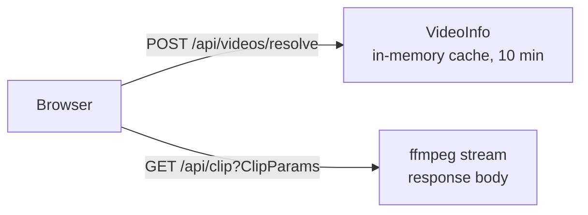
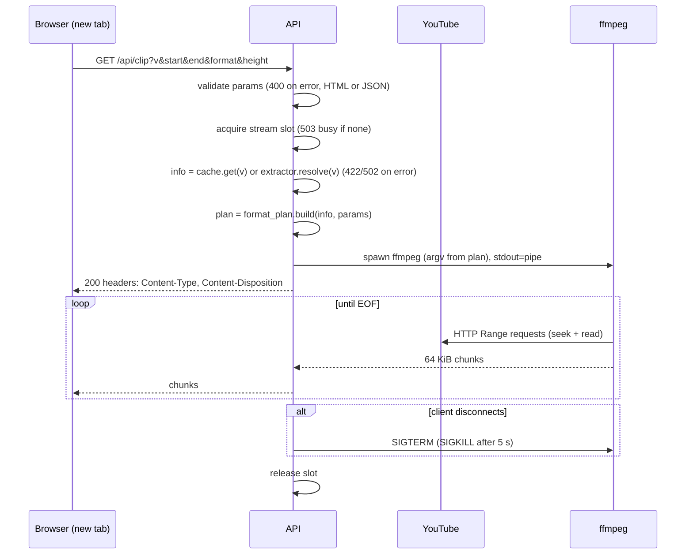

# Data Model: YouTube Clip Download

**Feature**: `001-youtube-clip-download` | **Date**: 2026-09-18 | **Phase**: 1 | **Revision**: 2.1 (stateless, nothing stored anywhere)

Source: spec.md → Key Entities & Functional Requirements; research.md → R1, R2, R4, R8, R11, R12, R13.

## Overview

There are **no persisted entities** — on the server (FR-020) or in the browser (R13). The spec's *Clip Request* is a transient set of query parameters (`ClipParams`) that exist only for the duration of one HTTP request; the *Clip File* is the response body of that request and is never stored; the *Source Video* is a read model cached in server memory for a few minutes purely to avoid a second YouTube round-trip.



## Read model: VideoInfo (server → client, cached in memory)

Produced by `POST /api/videos/resolve` from the yt-dlp info dict; cached per `video_id` for `CACHE_TTL_S` (600) with ≤ 50 entries (LRU). Lost on restart without consequence.

| Field | Type | Notes |
|-------|------|-------|
| `video_id` | string `^[A-Za-z0-9_-]{11}$` | Canonical ID (R12) |
| `canonical_url` | string | `https://www.youtube.com/watch?v=<id>` |
| `title` | string | |
| `channel` | string | Display only |
| `thumbnail_url` | string | Highest-resolution thumbnail |
| `duration_s` | integer ≥ 1 | Used to validate `end` |
| `embeddable` | boolean | `playable_in_embed`; hides preview when false |
| `has_audio` | boolean | Any format with `acodec != none` |
| `resolutions.mp4[]` | `VideoVariant[]` | Heights that have a video stream, descending. Any codec is valid inside MP4 |
| `resolutions.webm[]` | `VideoVariant[]` | Heights that have a VP9/AV1 stream, descending. May be empty → WebM disabled |
| `audio.m4a_kbps` | integer or null | Best AAC bitrate (MP4/M4A estimate) |
| `audio.opus_kbps` | integer or null | Best Opus bitrate (WebM/Opus estimate) |
| `start_hint_s` | integer or null | From `t=`/`start=` in the pasted URL (FR-004) |

`VideoVariant = { height: int, fps: int, vcodec: "avc1" | "vp9" | "av01", video_kbps: int }` — one entry per height (the codec the server will actually pick, so the estimate matches the download).

**Availability outcomes** are not fields; they are errors with codes `private`, `age_restricted`, `members_only`, `video_unavailable`, `live_in_progress`, `drm_protected`, `geo_blocked`, `bot_check`, `extraction_failed` (R11).

## Request model: ClipParams (query string of `GET /api/clip`)

| Param | Type | Rules |
|-------|------|-------|
| `v` | string | Video ID (11 chars) **or** any accepted YouTube URL (R12); canonicalised server-side |
| `start` | integer seconds **or** timestamp string | `0 ≤ start` |
| `end` | integer seconds or timestamp string | `start < end ≤ duration_s`; `end − start ≥ 1` |
| `format` | `mp4 \| webm \| mp3 \| m4a \| ogg \| opus` | |
| `height` | integer | Required for `mp4`/`webm`; must equal a `height` in `resolutions[format]`. Must be absent for audio formats |

Derived on the server: chosen video format id, chosen audio format id, ffmpeg argv (pure function `format_plan.build(info, params)`), `filename`, `content_type`.

## Enumerations

**OutputFormat**: `mp4`, `webm` (video + audio) · `mp3`, `m4a`, `ogg`, `opus` (audio only). `kind(format) ∈ {video, audio}`.

**ErrorCode**: `invalid_request`, `invalid_url`, `playlist_only`, `invalid_range`, `unsupported_format`, `unsupported_resolution`, `no_audio_track`, `private`, `age_restricted`, `members_only`, `video_unavailable`, `live_in_progress`, `drm_protected`, `geo_blocked`, `bot_check`, `extraction_failed`, `processing_failed`, `busy`.

## Request lifecycle of `GET /api/clip` (replaces the v1 state machine)



- Headers are sent only after ffmpeg produced its **first chunk** (≤ ~5 s warm) so that early failures (bad format, 403 from YouTube) can still be reported as a proper error status instead of a truncated file. If ffmpeg exits non-zero before the first chunk → `502 processing_failed`.
- After the first chunk, errors can only be signalled by closing the connection; the browser then marks the download as failed and the user can click again.
- No timeout is applied to the stream (FR-006).

## Validation rules (server-authoritative; mirrored in the SPA for inline feedback)

| Rule | Error code | Source |
|------|-----------|--------|
| `v` canonicalises to exactly one video ID | `invalid_url` / `playlist_only` | FR-001, FR-002, R12 |
| `0 ≤ start` | `invalid_range` | FR-005 |
| `end ≤ duration_s` (client clamps first) | `invalid_range` | FR-005 |
| `end − start ≥ 1` | `invalid_range` | FR-005, assumption "minimum one second" |
| **No upper bound** on `end − start` | — | FR-006 |
| `format ∈ OutputFormat` | `unsupported_format` | FR-010 |
| video format ⇒ `height` present and `∈ resolutions[format]` | `unsupported_resolution` | FR-011, FR-012 |
| audio format ⇒ `height` absent | `unsupported_resolution` | FR-011 |
| audio format ⇒ `has_audio` | `no_audio_track` | US2 scenario 5 |
| video public and not live | availability codes | FR-022 |
| stream slot available | `busy` (503 + Retry-After) | R5 — capacity guard, not a quota |
| No per-client counting of any kind | — | FR-007, FR-008 |

Timestamp grammar (FR-004; edge case "loose timestamp input"): `SS`, `MM:SS`, `HH:MM:SS`, `[Nh][Nm][Ns]`; `MM`/`SS` may exceed 59 in the `MM:SS`/`SS` forms; whitespace trimmed; display is always `HH:MM:SS`.

## Size estimate (client-side, R8)

```
video_kbps = resolutions[format].find(h => h.height === height).video_kbps   (0 for audio formats)
audio_kbps = format ∈ {mp4, m4a} ? audio.m4a_kbps
           : format ∈ {webm, opus} ? audio.opus_kbps
           : 190                                                               (mp3, ogg fixed VBR target)
estimate_bytes = (end − start) × (video_kbps + audio_kbps) × 1000 / 8 × 1.03    (3 % container overhead)
```

Shown as "≈ 12 MB" next to the Download control (FR-009); ≥ `VITE_LARGE_DOWNLOAD_BYTES` (default 500 MB) adds the bandwidth note. Never blocks.

## Files on disk

None (FR-020). The container writes only to `/tmp` for yt-dlp's cache (`--no-cache-dir` is set, so effectively nothing) and logs to stdout. The browser stores nothing either.
